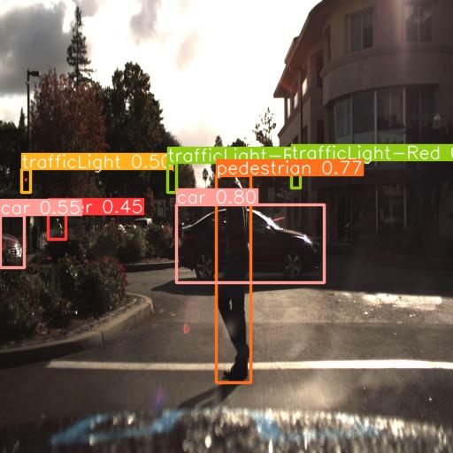
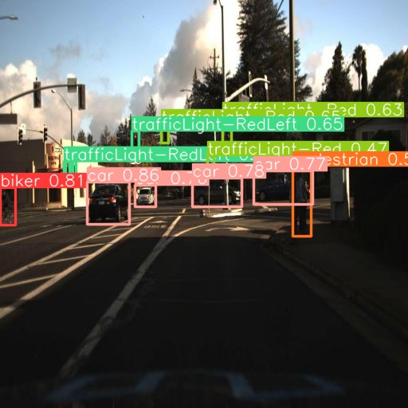
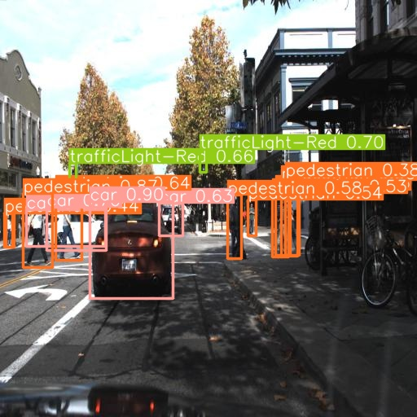
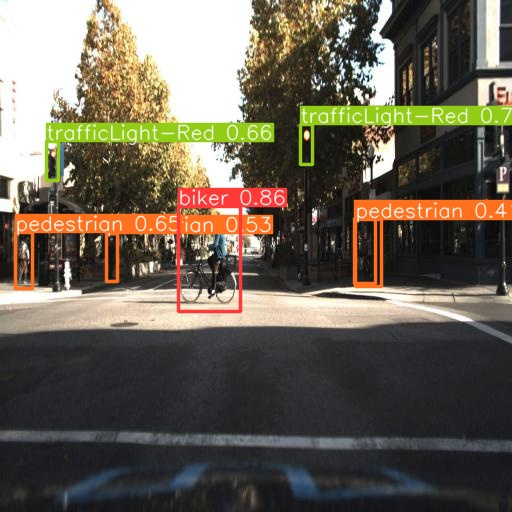
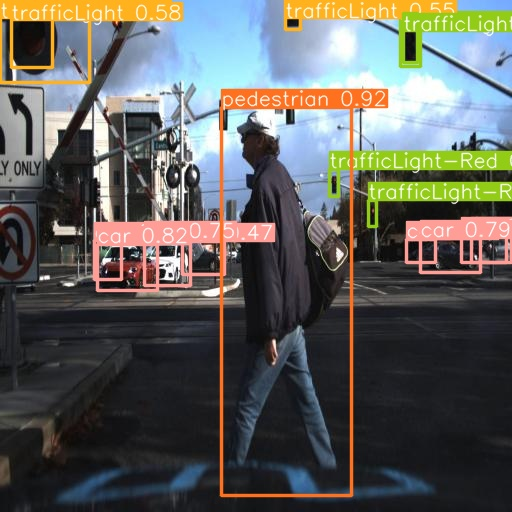
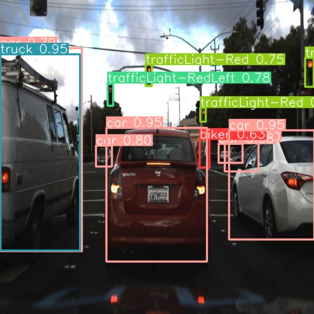

# YOLOv8 Fine Tuning for Self-Driving Cars

This project involves fine-tuning a pre-trained YOLOv8 model on an extended version of the original Udacity Self-Driving Car Dataset for object detection tasks. The aim is to improve the capabilities of autonomous vehicles in recognizing and distinguishing different types of objects on the road.

## Dataset

The dataset contains a total of 15,000 images with 97,942 labels across 11 different classes. Additionally, it includes 1,720 null examples (images with no labels).

The dataset is a richer extension of the original Udacity Self-Driving Car Dataset, which includes driving in Mountain View California and neighboring cities during daylight conditions. The original dataset contains over 65,000 labels across 9,423 frames collected from a Point Grey research cameras running at full resolution of 1920x1200 at 2hz. The dataset was annotated by CrowdAI using a combination of machine learning and humans.

The labels in the dataset include:
* Car
* Truck
* Pedestrian
* TrafficLight-Red
* TrafficLight-Green
* Truck
* TrafficLight
* Biker
* TrafficLight-RedLeft
* TrafficLight-GreenLeft
* TrafficLight-Yellow
* TrafficLight-YellowLeft

Each label in the dataset is in CSV format and includes:
* xmin
* ymin
* xmax
* ymax
* frame
* label
* preview url for frame

## Training

The training process involves fine-tuning a pre-trained YOLOv8 model on our dataset. We use the Comet.ml tool for tracking and managing machine learning experiments. The experiment results can be visualized on comet [here](https://www.comet.com/syphinx/yolov8-finetuning/626748230dcb4cfb96bbb775dc76edc0?experiment-tab=panels&showOutliers=true&smoothing=0&xAxis=step).

## Inference Results

Input Image 1: 

Output Image 1:

Input Image 2: 

Output Image 2:

Input Image 3:

Output Image 3:

Input Image 4:

Output Image 4:

Input Image 5:

Output Image 5:

Input Image 6:

Output Image 6:

## Acknowledgments

* Udacity for the original Self-Driving Car Dataset.
* CrowdAI for annotating the original dataset.
* OpenAI for the pre-trained YOLOv8 model.

---

